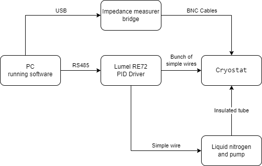
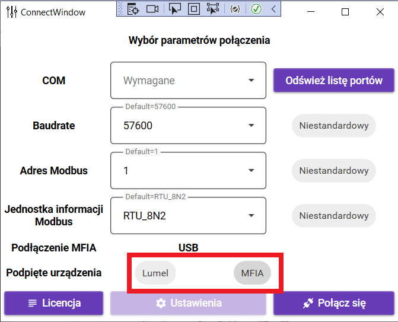
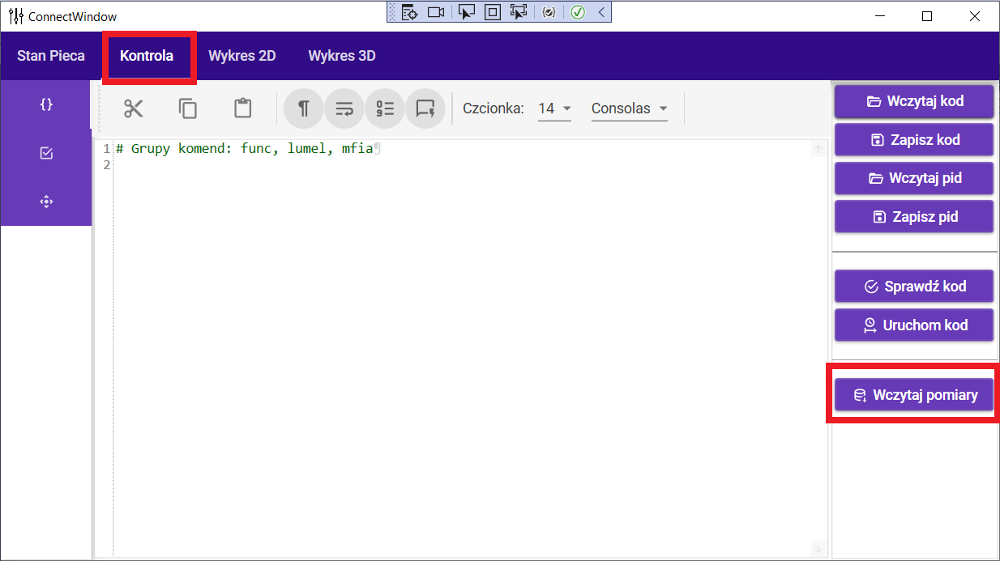
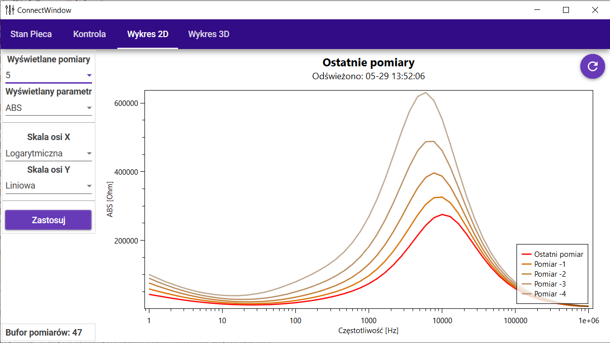
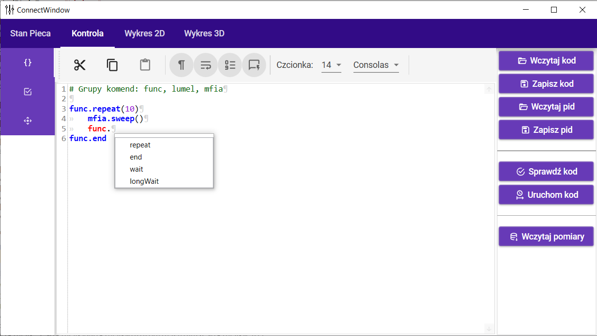
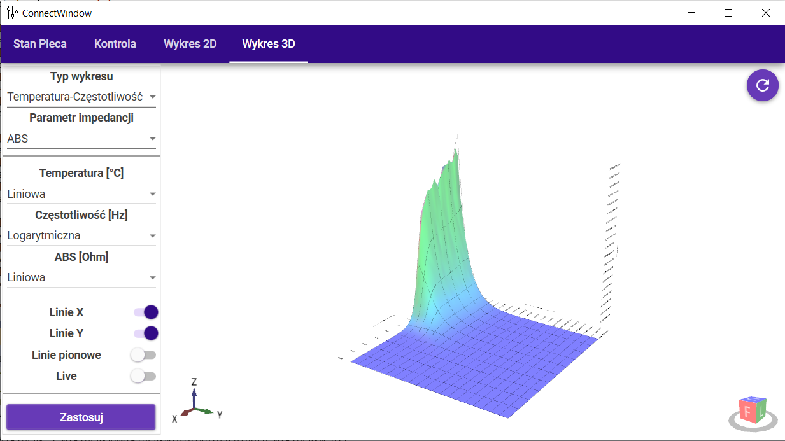

# Cryostat-control

This folder contain data from my software for controlling and data acquisition of cryostat.

Shared code is mostly functional. I removed only dlls for controling external hardware because I don't know if licence enable sharing it with third parties.

Fully compiled executable(without mentioned dlls so on startup connection do devices must be set to off) can be found here:

https://drive.google.com/file/d/1rGxib8ep7IGCDsH9srLwaGhoRryxXOlc/view?usp=sharing

### Block schematic of cryostat labolatory setup

### How to start provided executable and load example data

**Turn of connecition to external hardware**

**Load example data**

### Screenshots

