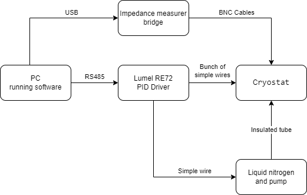

# Cryostat-control

This folder contain data form  software for controlling and data acquisition of cryostat which was my engineer thesis.

For some commercial and library licencing reasons I don't want to share full functional version of code which I have currently on hand of this project so I shared screenshots and some parts of code.

### Description of shared resources:

- CommunicationModule - Module used for connection with Lumel RE72 PID controler.
Main element is loop CommunicationEngine.communicationLoop located in CommunicationEngine.cs which is launched as standalone process.
- Controls - Definition of two semi-custom controls in program.
- Screenshots - Screenshots of working program.
- Tests - Test writen using Xunit library for testing critical parts of code.
- MainWindow.xaml - File containing main window GUI description code.

### Block schematic of cryostat labolatory setup

